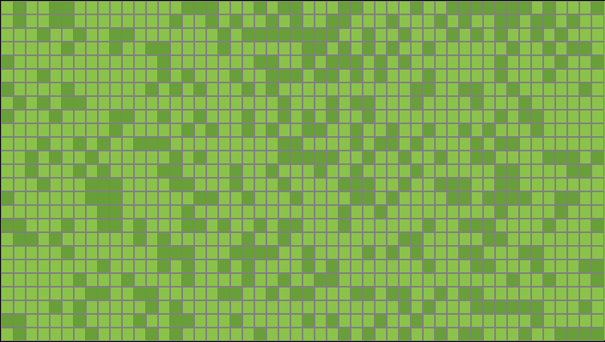

# Conway's Game of Life

## Table of Contents

- [About](#-about)
- [How to Build](#-how-to-build)
- [Feature](#-feature)
- [Documentation](#-documentation)
- [Feedback and Contributions](#-feedback-and-contributions)
- [Project Journey](#-project-journey)
- [Contacts](#%EF%B8%8F-contacts)

## 🚀 About

**Conway's Game of Life** is a fascinating example of a cellular automaton devised by British mathematician John Horton Conway in 1970. Despite its simplicity, it exhibits complex and often unexpected behaviors, making it a subject of interest in various fields such as mathematics, computer science, and artificial life.

Imagine each grid square you see above represents a cell. The dark green square is a living cell, and the light green square is a dead cell. Each cell interacts with its surrounding environment (the 8 neighboring cells around it), and the following rules determine the state of each cell in the next generation:

- A dead cell will be overjoyed and jump out of the graveyard when it is surrounded by 3 living neighbors (turns into a living cell).
- A living cell dances with 2 or 3 living neighbors in perfect harmony, no more and no less, just the right amount of neighbors.
- Unfortunately, all living cells are introverts and will die if they are surrounded by more than 3 living neighbors.
- A living cell can also die when it has fewer than 2 living neighbors; it's too awkward to be with just one living cell...

What makes **Conway's Game of Life** fascinating is that you can create something mesmerizing by applying these rules to every cell simultaneously. Originally, there is no winning or losing in this game. You can create and kill a cell by clicking on the squares on the board and simply observe the infinite possibilities of cellular automation. Try to discover various stable patterns within the grid.

For my project, I want to pay respect to John Horton Conway's work and also provide users familiar with **Conway's Game of Life** a new experience. My biggest inspiration is Pokemon Snap (a video game from Nintendo 64 in 1999) and the Pokedex from the Pokemon video game franchise. In Pokemon Snap, players are on a non-stop vehicle, and their main goal is to take pictures of Pokemon that only appear on the screen for a limited amount of time. Players can earn more points if they take a good picture. The Pokedex allows players to keep track of the Pokemon they've seen and caught in the game.

In my game, there are a total of 9 available life-form-mons for you to capture. I will go into more detail in the Features section. I hope you enjoy the experience.

## 🎨 How to Build

This project was bootstrapped with [Create React App](https://github.com/facebook/create-react-app).

## Available Scripts

In the project directory, you can run:

### `npm start`

Runs the app in the development mode.\
Open [http://localhost:3000](http://localhost:3000) to view it in your browser.

The page will reload when you make changes.\
You may also see any lint errors in the console.

### `npm test`

Launches the test runner in the interactive watch mode.\
See the section about [running tests](https://facebook.github.io/create-react-app/docs/running-tests) for more information.

### `npm run build`

Builds the app for production to the `build` folder.\
It correctly bundles React in production mode and optimizes the build for the best performance.

The build is minified and the filenames include the hashes.\
Your app is ready to be deployed!

See the section about [deployment](https://facebook.github.io/create-react-app/docs/deployment) for more information.
