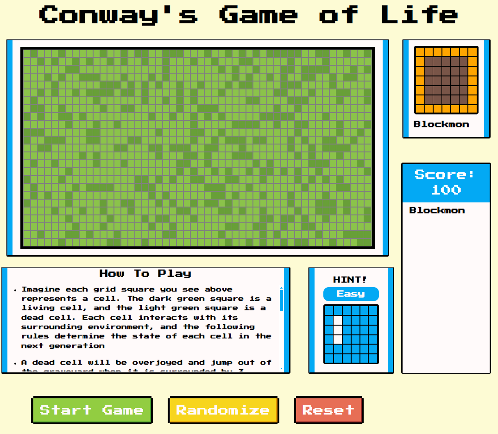

# Conway's Game of Life

## Table of Contents

- [About](#-about)
- [How to Use](#-how-to-use)
- [Features](#-features)
- [Roadmap](#-roadmap)
- [Project Journey](#-project-journey)
- [License](#-license)
- [Contact](-contact)

## 🚀 About

**[Conway's Game of Life](https://en.wikipedia.org/wiki/Conway%27s_Game_of_Life)** is a fascinating example of a cellular automaton devised by British mathematician John Horton Conway in 1970. Despite its simplicity, it exhibits complex and often unexpected behaviors, making it a subject of interest in various fields such as mathematics, computer science, and artificial life.


Imagine each grid square you see above represents a cell. The dark green square is a living cell, and the light green square is a dead cell. Each cell interacts with its surrounding environment (the 8 neighboring cells around it), and the following rules determine the state of each cell in the next generation:

- A dead cell will be overjoyed and jump out of the graveyard when it is surrounded by 3 living neighbors (turns into a living cell).
- A living cell dances with 2 or 3 living neighbors in perfect harmony, no more and no less, just the right amount of neighbors.
- Unfortunately, all living cells are introverts and will die if they are surrounded by more than 3 living neighbors.
- A living cell can also die when it has fewer than 2 living neighbors; it's too awkward to be with just one living cell...

What makes **Conway's Game of Life** fascinating is that you can create something mesmerizing by applying these rules to every cell simultaneously. Originally, there is no winning or losing in this game. You can create and kill a cell by clicking on the squares on the board and simply observe the infinite possibilities of cellular automation. Try to discover various stable patterns within the grid.

For my project, I want to pay respect to John Horton Conway's work and also provide users familiar with **Conway's Game of Life** a new experience. My biggest inspiration is [Pokemon Snap](https://pokemon.fandom.com/wiki/Pok%C3%A9mon_Snap) (a video game from Nintendo 64 in 1999) and the Pokedex from the [Pokemon](<https://en.wikipedia.org/wiki/Pok%C3%A9mon_(video_game_series)>) video game franchise. In Pokemon Snap, players are on a non-stop vehicle, and their main goal is to take pictures of Pokemon that only appear on the screen for a limited amount of time. Players can earn more points if they take a good picture. The Pokedex allows players to keep track of the Pokemon they've seen and caught in the game.

In my game, there are a total of 9 available life-form-mons for you to capture. I will go into more detail in the Features section. I hope you enjoy the experience.

<p align="right">(<a href="#readme-top">back to top</a>)</p>

## 🎨 How to Use

1. Clone the repo
   ```sh
   git clone https://github.com/ericpengJoJo/the-game-of-life.git
   ```
2. Install NPM packages
   ```sh
   npm install
   ```
3. Run the app
   ```sh
   npm start
   ```
4. Run the tests
   ```sh
   npm test
   ```
   <p align="right">(<a href="#readme-top">back to top</a>)</p>

## 🕹️ Features

- Toggle between alive and dead cells by clicking on the grid table when it's not running.
- Living cells generate automatically according to the Game of Life rules when you click the **Start Game** button.
- Pause the game and snap a picture of the life-form-mon by clicking the **Pause Game** button.
- Randomize and generate living cells on the grid table by clicking the **Randomize button**.
- Reset the game to its initial state by clicking the **Reset** button.
- Click on the **Hint** box to learn what available life-form-mons can be created.
- Unlock more life-form-mon data in the **Hint** box and unlock difficulty by capturing more life-form-mons.
- Observe your captured life-form-mons' animations in the life-formdex.
- List your captured life-form-mons and your score.
- Display a win game animation after capturing all available life-form-mons.



<p align="right">(<a href="#readme-top">back to top</a>)</p>

## 🎯 Roadmap

- [x] Add Life Form-dex showcase captured life forms
- [x] Add Score System
- [x] Add Difficulty System
- [x] Add Hint Box for life form creation
- [x] Add Win Animation after players capture all life forms
- [ ] increase score cap and allow players to capture same species multiple times
- [ ] Speed up automation when increase difficulty
- [ ] Lose game animation when players did not capture all life forms in time
- [ ] Add Log in screen for player to input name and pick a starter life form
- [ ] Add more Life Form-mons
- [ ] Add local leaderboard
- [ ] Add in game custom cursor

<p align="right">(<a href="#readme-top">back to top</a>)</p>

## 🌱 Project Journey

After some research and experimenting with other developers' Game of Life projects online, I was reminded of my experience in biology class, observing living cells through a microscope and recording their patterns of activity. While it was fascinating to observe, it can also be quite boring for people who aren't into biology and cannot distinguish what they are looking at. For Conway's Game of Life, I think the biggest issue is that it might not be an appealing game for people who aren't developers, despite it being able to create so many patterns of life forms through cellular automation. To learn more about their perspective, I decided to get some feedback from friends who aren't developers.

Originally, I felt the game might not be appealing due to a lack of guidelines for new players. Many examples I saw were just one big grid table with buttons to play and reset. After getting feedback from my friends, my assumption was further proven right as they couldn't even tell what was happening despite all the living cells running wild on the screen. How can they enjoy the game when they cannot understand anything on the screen? This is when I got my first idea: maybe I can change the color of stable pattern life forms during the automation, so players can tell the difference between a living cell and a life form

<details open>
<summary>
 Snapshot Feature
</summary> <br />
After implementing the basic Game of Life and gaining a deeper understanding of the iteration structure, I realized that the execution of my first idea might not be so simple due to my lack of consideration of the potential workload of this iteration, which has to run every second during automation. It might be possible if I just want the function to verify one or two life forms every second, but what happens when there are 15 or more life forms that need to be verified every second? I cannot even imagine the potential performance issues that would arise. Given the limited amount of time I have, I need to develop a feature that is more suitable for this scenario and, at the same time, doesn't diverge too far from my initial vision. This is when the idea of Pokémon Snap came into the picture.

When observing the Game of Life automation, I realized there are many life forms that only stay alive for a short period of time before they disappear. This is similar to how the player in Pokémon Snap only has a limited amount of time to take a picture of a Pokémon before it runs away. I also realized that pausing the game can resemble the player taking a picture. This means I only need to run this verification function when the user pauses the game. They work so well together, and I instantly approved this idea.

</details>

<details open>
<summary>
 Randomize Feature
</summary> <br />
While I was working on the life form verification feature, I also implemented a randomize feature, allowing users to generate living cells randomly on the grid table. This idea came to me because I am someone who likes to play around with a game before actually reading the tutorial. If users start the game by creating a couple of living cells on the map and they all quickly disappear after hitting **Start Game**, they will definitely feel disappointed and quit the game before they understand its essence.

By helping users generate a massive amount of living cells at once, they can instantly see the interactions of all the living cells as soon as they hit **Start Game**. Even though users might still be confused by the visual chaos, I believe it generates enough appeal to encourage them to check out the tutorial.

</details>

<details open>
<summary>
 Life-Formdex Feature
</summary> <br />
The idea of a Pokédex followed right after Pokémon Snap since I realized that players couldn't keep admiring what they caught because whatever life form-mon they captured would disappear after they hit Start Game again. Even if I changed the color of the life form-mon in the grid table, it would only be temporary. What if I had whatever players capture stored in a corner like a trophy? This method not only allows players more time to admire their achievements and learn how many life form-mons they've captured so far, but they can also learn more about what their captured life forms look like without feeling like it's a chore. From the developer's perspective, this approach also allows us to have more freedom to play with the visuals and maintain a healthier performance environment by not overloading a single component with too many tasks.

I also picked up the Context API at this point because I think it's perfect for this small-sized application. It involves less boilerplate code and, more importantly, makes it easier for other developers to review the state management structure in the context file.

Before players capture any life form-mon, I also keep the Life Formdex playing the radar detection animation in a loop. I think it's a good visual representation for new players to instantly understand that this gameplay involves them searching for something as soon as they see the page.

</details>

<details open>
<summary>
 Score system Feature
</summary> <br />
Besides giving players a sense of achievement by capturing new life form-mons, I also introduced a score system for future scalability of the application. At this moment, I intentionally only allow players to earn points by capturing each life form-mon for the first time to prevent players from spamming the pause button. However, I see great potential in this feature once we implement the ability to identify which life form-mon has already given the player points.
</details>

<details open>
<summary>
 Difficulty Feature
</summary> <br />
Similar to the score system, I also introduced the difficulty feature for future scalability. Players can progress to harder difficulties once they capture a certain number of life form-mons. In the future, I am considering increasing the speed of automation as players reach harder difficulties, making some life form-mons even more challenging to capture. For now, I use the difficulty feature to limit the number of hints players can get.
</details>

<details open>
<summary>
 Hint Box Feature
</summary> <br />
This feature was introduced relatively late in development, but it is definitely an important piece of the puzzle. Assuming this is the very first time that players are experiencing the Game of Life, they might not know what a stable life form is or what it looks like. The Hint Box can guide players to create their first stable life form and more. By advancing to harder difficulties, players can also unlock more puzzle pieces in the Hint Box, giving them a sense of progression.
</details>

<details open>
<summary>
 Life Form-mon sound effect and BGM Feature
</summary> <br />
This feature might seem quite small, but I think it is crucial for my game. By having a BGM and sound effect whenever players capture a new life form-mon, it can leave a strong first impression. I felt like I was playing a completely different game after implementing all the sound effects and BGM into the application. It also leaves an impression on players that what they just captured is alive and lively.

While implementing the Life Form-mon sound effect, I realized that if players capture multiple life form-mons all at once, it might cause the sound effects to overlap. To address this, I ensured the sound effect will only be triggered for the latest captured Life Form-mon.

</details>

<details open>
<summary>
 Win Animation Feature
</summary> <br />
I had multiple ideas on how to showcase the win animation once the players captured all the available life forms. First, the grid tables would turn blank and then generate a champion cup image with 1s and 0s. Second, I planned on having the hint box play a firework animation through iteration. However, I gave up both ideas due to lack of time. While my final solution might seem basic, I think the winning page and BGM did a decent job.
</details>

Overall, this project demonstrates a balance between creating an engaging user experience and maintaining scalability and performance. I hope you can appreciate my vision after trying out the application. Thank you for reading.

<p align="right">(<a href="#readme-top">back to top</a>)</p>

## 🌟 License

This project is for US Mobile job interview only.

<p align="right">(<a href="#readme-top">back to top</a>)</p>

## 🌌 Contact

Eric Peng - ericpengjojo@gmail.com

<p align="right">(<a href="#readme-top">back to top</a>)</p>
